# APCO Aviation — Mayday Reserve Parachute — User Manual

> **Source:** this is a Markdown reproduction of the official APCO Aviation *Mayday* user manual.
> Original PDF: <https://www.apcoaviation.com/wp-content/uploads/2017/12/manual_mayday.pdf>
> A local copy is kept in this repository: [`manual_mayday.pdf`](manual_mayday.pdf).
> All photographs are extracted from that PDF. Obvious spelling mistakes of the original have been
> corrected; the wording, structure and technical content are unchanged. Packing steps have been
> numbered for convenience — the original manual gives them as headings only.
>
> Russian version: [`manual-ru.md`](manual-ru.md)

---

## Index

- [Introduction](#introduction)
  - [Disclaimer of Liability and Warranty](#disclaimer-of-liability-and-warranty)
  - [Description](#description)
  - [Specifications](#specifications)
  - [Maintenance](#maintenance)
- [Packing](#packing)
  - [Preliminary Notes on Packing](#preliminary-notes-on-packing)
  - [Tools and Equipment](#tools-and-equipment)
  - [Airing, Layout and Folding](#airing-layout-and-folding)
  - [Fitting to the Deployment Bag](#fitting-to-the-deployment-bag)
- [Deployment](#deployment)
  - [Using Your Mayday](#using-your-mayday)

---

## Introduction

Even pilots flying the safest paragliders or hang gliders can sometimes find themselves with their
glider damaged, disabled or tangled and out of control. In such cases a reliable emergency system
with a fast opening parachute can make the difference between a simple scare and a fatal accident.
Your emergency system has been designed for a fast opening at a low air speed. Do not, under any
circumstances, use this emergency system for free fall parachuting.

APCO is happy and proud that its emergency systems, developed and perfected over nearly three
decades, have saved the lives of many pilots, from beginners to world champions. This manual
describes 6 such emergency systems: three for paragliding and three for hang gliding.

> ### ⚠️ WARNING
>
> Your emergency system has been designed for a fast opening at a low air speed. **Do not, under any
> circumstances, use this emergency system for free fall parachuting.**

### Disclaimer of Liability and Warranty

In designing and manufacturing the Mayday parachutes and any of its subassemblies or accessories,
our aim has been to create a rescue system that will allow the user to engage in the sport of
paragliding or hang gliding in a safe and confident way.

However, both paragliding and hang gliding are high risk activities, which may cause or result in
serious injury or death. When you take it upon yourself to participate in one or both of these
sports, you accept the risk inherent therein. You may reduce the risk by receiving proper
instruction and by following the basic safety requirements. The Mayday Reserve Parachute System is a
sensitive device, which may easily be damaged. Before each flight, the container should carefully be
inspected for evidence of damage or wear and proper closure. Any deviation from the manufacturer's
specifications concerning maintenance, repair, alterations and modifications constitutes willful
negligence. It is expressly understood and agreed that by the use hereof by the buyer or any
subsequent user that Apco Aviation Ltd. and/or the seller shall in no way be deemed or held liable
or accountable and makes no warranty, either expressed or implied, statutory, by operation of law or
otherwise, beyond that expressed herein. Paragliding and Hang gliding equipment is sold with all
faults and without any warranty of merchantability or fitness for any purpose, expressed or implied.
Apco Aviation Ltd. disclaims any liability in tort for damages, direct or consequential, including
personal injuries, resulting from a malfunction or from a defect in design, manufacturing, materials
or workmanship, whether caused by negligence on the part of Apco Aviation Ltd. or otherwise. By
using any Paragliding or Hang gliding equipment manufactured or sold by Apco Aviation Ltd., or
allowing it to be used by others, the buyer and/or user waives any liability on the part of Apco
Aviation Ltd. for personal injuries or any other damages arising from such use.

The liability of Apco Aviation Ltd. is limited to the replacement of defective parts found under
examination by manufacturer to be defective in material or workmanship within 120 days after
purchase, and which has not been caused by an accident, striking, improper use, alteration,
tampering, excessive use, misuse or abuse. The damages of the buyer and/or user shall be deemed
liquidated in the costs of replacement as above.

### Description

The Apco Mayday series of parachutes are flat circular **pull-down apex** reserves. This means that
in addition to the conventional lines around the perimeter (**skirt**), there is a single line in the
center pulling the **apex** down to the level of the skirt, running from the apex to the **bridle**.
The main line attachments to the skirt are reinforced with V-Tabs, and the skirt and apex skirt are
reinforced with 1" tape, and sewn with a four needle machine for an exact finish. This proven design
offers the best combination of sink-rate, deployment speed, packing size and weight.

### Specifications

| Mayday             | 16          | 18        | 20         | Bi          |
| ------------------ | ----------- | --------- | ---------- | ----------- |
| Area               | 25 m²       | 30 m²     | 37 m²      | 47 m²       |
| Gores              | 16          | 18        | 20         | 18          |
| Line Length        | 4700 mm     | 5150 mm   | 6720 mm    | 5875 mm     |
| Center Line Length | 4700 mm     | 5150 mm   | 7300 mm    | 6310 mm     |
| Weight             | 1.863 kg    | 2.220 kg  | 2.690 kg   | 3.250 kg    |
| Sink Rate          | 6.1 m/s     | 5.4 m/s   | 5.4 m/s    | 5.4 m/s     |
| Max Load           | up to 106 kg | 75–120 kg | 100–160 kg | 120–200 kg |
| Certification      | DHV         | SHV       | AFNOR/CEN  | AFNOR/CEN   |

### Maintenance

The materials we use to manufacture the Mayday range of parachutes are carefully selected from the
best mil. spec. products available on the market today. These materials are however sensitive to
sunlight (UV). The container or harness will protect the canopy from ultra-violet rays. When storing
the parachute it should be kept in a cool dry place. Beware of mildew. Should your parachute be
exposed to any moisture, it must be opened and air dried, out of direct sunlight, and repacked when
completely dry.

#### Cleaning

If your parachute requires cleaning, it should be soaked in luke warm water with a little mild soap.
No rubbing or scrubbing of the canopy fabric! It should then be thoroughly and repeatedly rinsed
with fresh water and allowed to drip dry out of direct sunlight.

#### Repairs

Should your Mayday parachute require any repairs or you suspect it may be damaged, it must be
referred back to APCO Aviation Ltd. or a professional parachute loft, with a certified parachute
rigger to carry out the repair.

#### Periodical Repacks

Even though the Mayday Emergency System should remain in good condition and work properly over a
number of years, we strongly recommend that the parachute be repacked by a qualified person once
every six months. Packing by an unqualified person is undertaken at the pilot's own risk, and is not
recommended by Apco.

#### Identification

In the corner where the #1 suspension line meets the skirt, there is an Apco stamp, along with the
individual serial number, canopy type and manufacture date. This data is repeated on a label
attached to the bridle in post 1995/6 models. In any correspondence to Apco regarding your Mayday,
please quote this information.

#### Attachment Procedure

There are many different harnesses on the market today, with several different reserve stowing
systems. Make sure your harness is certified and has an adequate instruction manual. For attaching
and fitting your reserve to your harness follow your harness manual instructions carefully.

---

## Packing

### Preliminary Notes on Packing

The following instructions apply to **ALL** models of the Mayday range, unless otherwise stated.

When first delivered, your new emergency parachute system has been inspected and packed by Apco or
an Apco approved dealer and is ready for use. The following set of folding instructions is intended
for a qualified packer familiar with conventional parachute packing, to guide him/her in packing of
these particular types of parachutes.

#### The Modularity of Apco Emergency Systems

Although the above specifications list eight separate types, with slightly different inner and/or
outer containers, the "heart" of the system — the parachute and its bridle — are only a combination
of four different parachutes and three different types of bridles:

**Parachute**

The smallest, MD16 parachute, for a maximum hook-in weight (pilot, glider, harness and emergency
system) of 106 kg; the MD18 for a maximum hook-in weight of 120 kg; the MD20 for up to 180 kg and
the MD Bi Tandem parachute for a maximum of 220 kg.

> **Note:** the original PDF prints "the MD20 for a maximum hook-in weight of 120kg" twice, which is
> clearly a typo for MD18. The maximum loads quoted here also differ slightly from the
> [Specifications](#specifications) table above (180 kg / 220 kg vs. 160 kg / 200 kg). Where the two
> disagree, use the certified figures from the specifications table.

**Bridle**

- **Short:** about 30 cm in length, for solo paragliding systems, because of the short distance
  between the packed parachute and its attachment point to the harness (the parachute is designed to
  open slightly below the paragliding canopy).
- **Long:** about 6 meters in length, for all hang glider systems, due to the need of clearing the
  glider frame on opening.
- **V-Bridle:** for tandem paragliding systems. This bridle is attached to the top of the spreader
  system, so that both pilot and passenger are suspended at an equal height.

### Tools and Equipment

#### Table

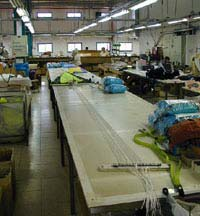

Although the Mayday can be folded on the ground, provided it is smooth and clean, the best
arrangement is to use a long table, or several tables placed end to end, with a smooth surface, 8 m
long, 1 m wide and about 80 cm high. At each end of the table there should be a hook-up point for
attaching and tensioning the reserve. Woodwork clamps work well.

#### Comb

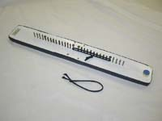

This is a wooden board with a row of two groups of 11 nails each, which serves to keep the lines
separated and in correct order during folding. The nails protrude about 20 mm above the board. The
central gap between the two groups of nails is 20 mm. The general nail spacing is 10 mm. The board
measures approximately 30 cm long, 7–10 cm wide and around 20 mm thick. The board and the nails
should be smooth, without any sharp corners or edges that may damage the parachute or lines.

#### Clamps or Weights

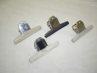

Six lightly spring-loaded clamps, such as paper clamps, are ideal. It is also possible to use
weights, such as small sandbags, solid weights or even books. Whichever you use, they should have
smooth edges and no sharp corners.

#### Carabiners

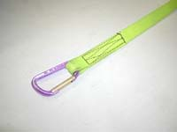

It is useful but not essential to have two carabiners for attaching the apex and lines to the table
hook-up points. Some string such as glider lines will also do.

#### Tie-down Straps (2)

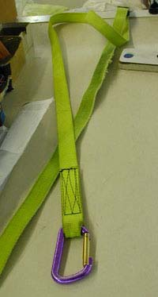

This is also useful but not necessary; it is used to tension the lines. Some rope or line will
suffice.

---

### Airing, Layout and Folding

#### 1. Airing

Before starting the repack procedure it is recommended to "air" the canopy for 24 hours. This is
best done by suspending the canopy from its apex, from a point on the ceiling. This should be done
in a cool dry place out of direct sunlight.

#### 2. Layout

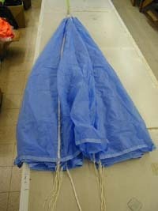

Lay the extended canopy on the table as shown. Attach a carabiner through all the apex lines and
through the loop of the center apex line (the one that leads to the bridle). Clip this carabiner to
the hook-up point on one side of the table.

One of the gores bears an Apco tag in a lower corner, next to the attachment point of a line. This
is the **No. 1 line**. The first and last lines (No. 1 and 16, 18 or 20) are numbered in this way on
all parachutes. The remaining lines (No. 2 and up) may or may not be numbered depending on the year
of manufacture. If they are not numbered, count them in a counter-clockwise fashion (when standing
near the skirt looking toward the apex, starting at the bottom).

#### 3. Apex Hook-up Detail

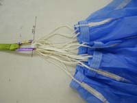

The apex should be clipped or tied through **all** the apex cross-over lines **AND** the apex center
line (which runs down inside the canopy to the bridle).

#### 4. Suspension Line Hook-up

Clip another carabiner around all the suspension lines except the central line, as shown, and attach
it with two tie-down straps to the second hook-up point on the opposite end of the table from the
apex. Apply some tension until all the lines are straight.

#### 5. The Bridle Position

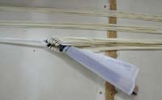

The bridle should now be somewhere in between the skirt and the carabiner attached to the suspension
lines.

#### 6. Comb Placement

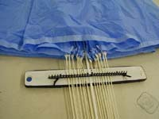

Place the comb under the lines near the skirt of the canopy. The purpose of the comb is to ensure
that all the lines run parallel to each other all the way from the skirt to the bridle, without
crossing, twisting or tangling.

Place the center line in the wider gap in the center of the comb.

#### 7. Line Placement into the Comb

Place line No. 1 in the first gap immediately to the right of the center line, then line No. 2
immediately right of line No. 1, and continue in this fashion until half of the lines are used. It
is important to ensure that you use the lines in the correct order. The easiest way to do this is to
flip the gores over onto the left hand side. The amount will be **8 for the Mayday 16, 9 for the
Mayday 18, 10 for the Mayday 20 and 9 for the Mayday Bi**.

Now use a strong elastic to secure these lines in place, including the center line, by hooking the
elastic over the first and last nails in the group.

Flip all the gores over to the right hand side and start with the lines on the left hand side in a
similar fashion to the right. Place the last line (No. 16, 18 or 20) in the gap immediately left of
the center line, then follow it with the line before last, and so on until you have an equal number
of lines on either side of the comb. Secure the lines with a second strong elastic band or hair
elastic.

#### 8. Move Comb

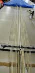

Move the comb approximately one meter down the lines away from the skirt. Flip the left hand group
of gores over the right hand group again.

#### 9. Paging the Left

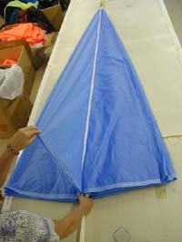

Flip the left hand group of gores over the right hand group. Bring the flipped gores back one by
one, lifting them with one hand by the point halfway between the two line attachment points, while
holding all the lines down together on the table with the other hand. Make sure to lift the complete
gore up by applying a little tension with the lifting hand against the apex. While doing this,
carefully inspect each panel on both sides for wear, damage, stains, deterioration, mildew, etc.

#### 10. Stacking the Left

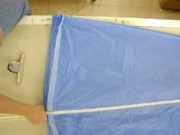

Neatly place each panel down on top of each other, making sure that the folds halfway between the
two hook-up points are all lining up at the corner formed by the gores on the left. Also take time
to neatly align all the skirt webbing, one fold on top of the next. **Do not take more than half of
the gores!** Use some paper clamps or weights to keep the folded gores in place.

#### 11. Corner Fold-over — Left

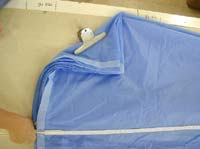

Make a fold halfway along the left hand base at 45° and clamp it in place.

#### 12. Paging the Right

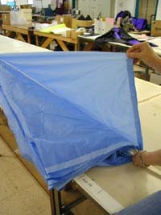

Flip all the right hand gores across onto the left. Now repeat the above paging steps for the right
hand side. Remember to clamp or hold all the lines together at the hook-up points.

#### 13. Corner Fold-over — Right

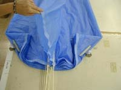

Lift the uppermost gore from the right hand side and then make the 45° corner in a similar fashion
as done on the left (exclude the uppermost gore from the fold-over). Clamp the fold in place.

#### 14. Gore Count

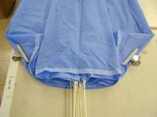

The number of gores on each side should now be as follows, with one in the middle on top:

| Model     | Gores on the left | Gores on the right |
| --------- | ----------------- | ------------------ |
| Mayday 16 | 8                 | 7                  |
| Mayday 18 | 9                 | 8                  |
| Mayday 20 | 10                | 9                  |
| Mayday Bi | 9                 | 8                  |

#### 15. Clamp

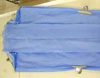

Place two additional clamps just less than halfway along the folded canopy, making sure that all the
folds are even on both sides.

#### 16. Tension Release

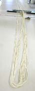

Release the tension at the top and unclip both the carabiners: on the lines near the bridle, and the
apex fastening carabiner.

#### 17. Apex Insertion

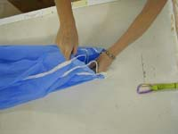

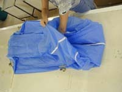

By hand, gently insert the apex into the top of the canopy, between the gores, as far as you can
reach.

#### 18. Pulling Down the Apex

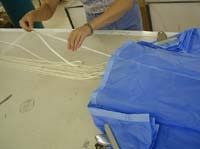

Take the bridle and slowly pull it away from the skirt, so as to tension all the lines. Have an
assistant do this while you ensure that the top end folds neatly as the apex is pulled down into the
canopy. All the lines, including the center/apex line, should now be straight and of an equal
length.

#### 19. Apex Position

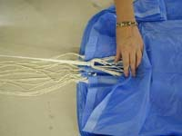

The apex lines should not be pulled any further than the skirt. On some sizes the apex will not
reach the skirt at all. Make sure that all the lines including the apex line are now equalized with
the bridle fully extended away from the canopy.

#### 20. Combing

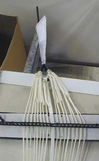

Hook the bridle to the clamp at the end of the table and tension the lines (move the canopy if
necessary). Move the comb all the way towards the bridle, "combing" the lines all the way up to
their attachment points on the bridle.

> **IT IS OF UTMOST IMPORTANCE THAT THE LINES SHOULD RUN STRAIGHT AND PARALLEL TO ONE ANOTHER ALL
> THE WAY FROM THE CANOPY SKIRT TO THE BRIDLE, WITHOUT ANY CROSSING OR TWISTING, AND THAT THE BRIDLE
> SHOULD LAY SO THAT THEY JOIN IT SIDE BY SIDE. THE BRIDLE SHOULD NOT BE TURNED OR TWISTED IN THE
> SUBSEQUENT STAGES OF FOLDING.**

Any twists or tangles can be undone by manipulating the bridle in the correct direction. If not, you
have laid some of the panels incorrectly and you will have to start over.

#### 21. Remove Comb

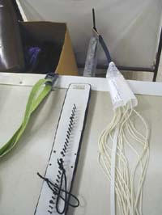

Remove the comb and pull the ripstop line attachment cover over the lines after inspecting each
attachment carefully. Make sure there is no wear or unraveling of stitching.

#### 22. Shape

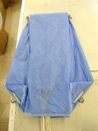

This is what the partly folded canopy should now look like.

#### 23. Top Fold

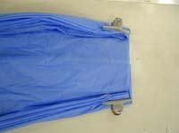

Remove the top clamps and make a fold on each corner as shown, and then replace the clamps to hold
the folds.

Continue both the folds along the length of the canopy by folding over the bottom corners (45°
corners) to achieve a rectangular shape as shown in the next photo.

#### 24. Center Gore

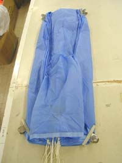

Pull out the center gore just a little, from under the folds, and flatten it in its place. It should
now be covering the start of the folds on either side as shown.

#### 25. Top Fold (in Half)

Fold the top of the reserve in half. Remove the clamps and replace one to hold the new fold in
place.

Now pull the "opening" / skirt of the center gore out to the left as shown.

#### 26. Folding

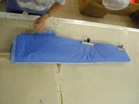

Fold the right hand side of the bottom section onto the left. Place one of the free clamps halfway
along the pack.

#### 27. Check Opening

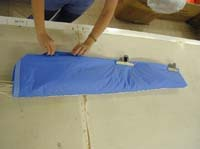
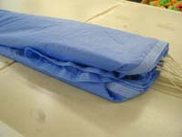

Make sure that the opening / skirt of the central gore is neatly in place, and lying along the
bottom edge, and continues up the side between the layers formed by the left and right hand sides.

---

### Fitting to the Deployment Bag

#### 28. Deployment Container / Nappy Sizing

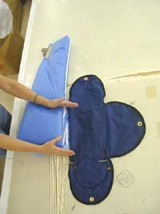

Place the deployment container / nappy next to the reserve. Make sure that the side with the bungee
is facing up and that the bungee is pointing to the side the lines leave the pack, as shown.

Fold the "pack" in a zigzag pattern so as to form a square that will fit in the center part of the
deployment container.

#### 29. Zigzag Folding

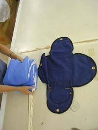
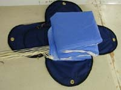

Lift the pack onto the deployment container.

#### 30. Closing (Step 1)

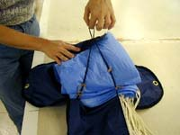

Lift flap No. 1 (opposite side of the bungee) and thread a loop from the center of the bungee
through the grommet in the flap.

#### 31. Closing (Step 2)

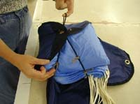

Lift flap No. 2 (on the left) and thread the bungee loop through the grommet in the flap.

#### 32. Closing (Step 3)

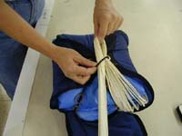

Lift flap No. 3 (on the right) and thread the bungee loop through the grommet in the flap. Now pass
a loop of the suspension lines through the bungee loop to lock the three flaps in place. The loop of
lines should protrude only about 5–6 cm through the bungee.

An additional check of the bungee: the loop of the lines should begin to slip out under a force of
**not more than 200 grams**.

#### 33. Line Stacking (Step 1)

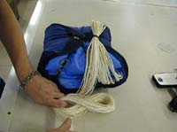

Take four light latex-rubber bands and inspect them for cracks, wear and fatigue. It is best to use
special parachute grade elastics obtainable from Apco, or your Apco dealer. If, however, you must
use simple office rubber bands, they must be approximately 4 cm in diameter, with a square section
of 1–1.5 mm, fresh and of good quality and of uniform cross-section.

Attach two elastics to each side of the bungee cord, approximately 3 cm apart, and 3 cm away from
the end (attachment point to the deployment bag) of the cord.

Begin to fold the lines into a zigzag of a width equal to the width of the folded canopy package. It
is easiest to do this properly by folding them into flattened figure-eights, on top of one another.

#### 34. Line Stacking (Step 2)

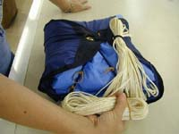

After using just less than half the total line length, stop and insert the "stack" into the lower
set of elastics attached to the bungee.

#### 35. Line Stacking (Step 3)

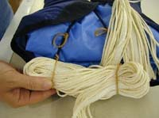

The right hand elastic should be to the left of the lines leading from the skirt to the first
closing loop, but to the right of where the lines lead from the first closing loop to the line
"stack".

#### 36. Line Stacking (Step 4)

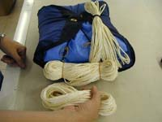

Now make a second "stack" of lines in a similar fashion to the first, using all but the last
60–70 cm of suspension lines.

#### 37. Line Stacking (Step 5)

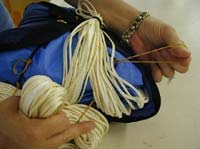

Place this "stack" in the upper set of elastics. The right hand elastic should be to the right of
the lines leading from the skirt to the first closing loop.

#### 38. Line Stacking (Step 6)

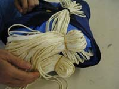

#### 39. Line Stacking (Step 7)

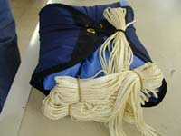

#### 40. Line Stacking (Step 8)

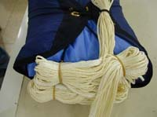

Make sure that all the lines are arranged neatly, without twists, line-overs, etc.

#### 41. Line Stacking (Step 9)

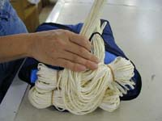

Now fold the remaining section of the suspension lines across the "pack".

#### 42. Second Closing Loop

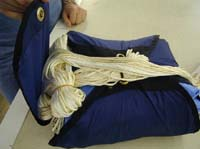

Fold the fourth flap of the container over the stacked lines. Lift the bungee on top of the first
closing loop and pass the loop through the grommet on the flap.

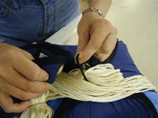

Lock the last flap in place with a loop of the suspension lines to make the second closing loop.

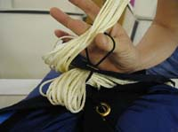
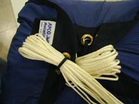

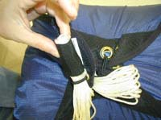

Pass the closing loop through the webbing loop on the last flap to keep it clear of the loop of the
first closing loop.

#### 43. The Packed Parachute

#### 44. Test

Test the force required for the closing loop to slip through the bungee. There are two methods to do
this.

Hook a spring balance to a loop in the remaining part of the suspension lines and hold the bridle
down next to the container. Slowly lift the scale until the lines start to slip through the bungee
and take the reading of the scale at this point.

The force required using this method should **not exceed 400 grams**.

#### 45. Test (Direct Method)

Using the second (direct) method one hooks the scale directly to the bridle.

The force should **not exceed 200 grams** with this method.

---

## Deployment

### Using Your Mayday

It is of course best if you never have to use it, but even then, flying with an emergency system
provides peace of mind and a feeling of security, which make your flights even more enjoyable.

Some paragliding and hang gliding schools and clubs offer courses in the use of emergency systems,
and it is recommended to take such a course. The openings are carried out over water and the pilot
wears a flotation vest. Once in the water a boat picks them and the equipment out. Such a course
provides valuable experience, and adds confidence in your emergency system.

### Opening Your Emergency Parachute

The first step in opening your emergency parachute is the decision to do so. If you have lost
control of your aircraft at a considerable height and there is a chance of regaining it, you still
have time to try. Once you have opened your emergency parachute, you are committed to it and to
where it is going — there's no turning back and you are committed to an emergency landing.

If, on the other hand, the emergency arises at a low altitude, you should decide as quickly as
possible. It is generally considered that emergency parachutes should be carried whenever you intend
to fly higher than 50 m above ground. There are recorded cases of saves occurring at even lower
altitudes.

Once you have decided to open your emergency parachute, do it in the following steps:

1. **Look** for your emergency handle and identify it. This is no time for mistakes.
2. **Grab** the handle firmly with your thumb as well as the four fingers.
3. **Pull** — give a strong pull. This undoes the velcro covers and pulls the locking pins out of
   the loops. The outer container opens and you are now holding the closed inner container attached
   to the handle, with the canopy and lines stowed inside.
4. **Throw** the parachute as strongly as you can in the direction which is (a) unobstructed by your
   paraglider or hang glider, and (b) which is also preferably the direction of the airstream past
   you — this will help to open your parachute faster.
5. **Neutralize the glider.** If you have been flying a paraglider, neutralize it as soon as the
   emergency parachute opens, and keep it neutralized. If it re-opens, it will interfere with the
   emergency parachute.
6. **Land** with your knees together, slightly bent, landing on your feet and rolling to one side
   over your shoulder in a typical parachutist's landing fall.
