# APCO Aviation — запасной парашют Mayday — руководство пользователя

> **Источник:** это перевод официального руководства APCO Aviation по запаске *Mayday*.
> Оригинальный PDF: <https://www.apcoaviation.com/wp-content/uploads/2017/12/manual_mayday.pdf>
> Локальная копия лежит в этом репозитории: [`manual_mayday.pdf`](manual_mayday.pdf).
> Все фотографии извлечены из этого PDF. Английская markdown-версия: [`manual-en.md`](manual-en.md).
>
> Перевод контекстный, по смыслу, с использованием принятой парапланерной и парашютной
> терминологии. Очевидные опечатки оригинала исправлены, шаги укладки пронумерованы для удобства —
> в оригинале они даны просто заголовками. Содержание и порядок действий не изменены.
>
> ⚠️ Перевод — вспомогательный материал. В спорных местах ориентируйтесь на оригинальный PDF, а
> укладку доверяйте квалифицированному укладчику.
>
> 🖼️ **Фотографии здесь не оригинальные, а увеличенные вдвое нейросетью** (Real-ESRGAN): в PDF они
> 200 пикселей шириной и на телефоне почти не читаются. Имейте в виду, что сеть не восстанавливает
> утраченное, а дорисовывает правдоподобное — мелкие детали на таких снимках могут отличаться от
> того, что было снято. Нетронутые кадры лежат в папке [`images/`](images/) и в самом PDF.
>
> **© Текст и фотографии: APCO Aviation Ltd., все права защищены.** Это неофициальная перепечатка,
> никак не связанная с APCO; подробности — в [`README.md`](README.md#авторские-права).

---

## Содержание

- [Введение](#введение)
  - [Отказ от ответственности и гарантия](#отказ-от-ответственности-и-гарантия)
  - [Описание конструкции](#описание-конструкции)
  - [Технические характеристики](#технические-характеристики)
  - [Обслуживание](#обслуживание)
- [Словарь терминов](#словарь-терминов)
- [Укладка](#укладка)
  - [Предварительные замечания](#предварительные-замечания)
  - [Инструменты и оборудование](#инструменты-и-оборудование)
  - [Проветривание, раскладка и складывание](#проветривание-раскладка-и-складывание)
  - [Укладка в контейнер](#укладка-в-контейнер)
- [Применение](#применение)
  - [Как пользоваться Mayday](#как-пользоваться-mayday)

---

## Введение

Даже пилоты, летающие на самых безопасных парапланах или дельтапланах, иногда оказываются в
ситуации, когда крыло повреждено, выведено из строя, запуталось или потеряно управление. В таких
случаях надёжная спасательная система с быстро раскрывающимся парашютом решает, останется ли это
просто испугом или закончится смертельным исходом. Ваша спасательная система рассчитана на быстрое
раскрытие на малой воздушной скорости. Ни при каких обстоятельствах не используйте эту систему для
затяжных прыжков (свободного падения).

APCO рада и горда тем, что её спасательные системы, разрабатывавшиеся и совершенствовавшиеся почти
три десятилетия, спасли жизни многим пилотам — от новичков до чемпионов мира. Это руководство
описывает 6 таких систем: три для парапланов и три для дельтапланов.

> ### ⚠️ ПРЕДУПРЕЖДЕНИЕ
>
> Ваша спасательная система рассчитана на быстрое раскрытие на малой воздушной скорости.
> **Ни при каких обстоятельствах не используйте её для затяжных прыжков (свободного падения).**

### Отказ от ответственности и гарантия

При проектировании и производстве парашютов Mayday, а также всех их узлов и принадлежностей нашей
целью было создать спасательную систему, которая позволит пользователю заниматься парапланеризмом
или дельтапланеризмом безопасно и уверенно.

Тем не менее и парапланеризм, и дельтапланеризм — виды деятельности повышенного риска, которые могут
привести к тяжёлым травмам или смерти. Принимая решение заниматься одним или обоими этими видами
спорта, вы принимаете на себя присущий им риск. Снизить риск можно, пройдя надлежащее обучение и
соблюдая базовые требования безопасности. Спасательная система Mayday — чувствительное устройство,
которое легко повредить. Перед каждым полётом контейнер следует внимательно осматривать на предмет
повреждений, износа и правильности закрытия. Любое отступление от указаний производителя в части
обслуживания, ремонта, переделок и модификаций является умышленной небрежностью. Прямо
устанавливается и признаётся, что при использовании изделия покупателем или любым последующим
пользователем компания Apco Aviation Ltd. и/или продавец ни в коей мере не считаются ответственными
и не дают никаких гарантий — явных или подразумеваемых, установленных законом или иным образом —
сверх изложенных здесь. Парапланерное и дельтапланерное снаряжение продаётся «как есть», со всеми
недостатками и без каких-либо гарантий товарного состояния или пригодности для какой-либо цели,
явных или подразумеваемых. Apco Aviation Ltd. снимает с себя любую внедоговорную ответственность за
ущерб, прямой или косвенный, включая телесные повреждения, возникший из-за неисправности или дефекта
конструкции, изготовления, материалов или качества работы, независимо от того, вызван ли он
небрежностью со стороны Apco Aviation Ltd. или иными причинами. Используя любое парапланерное или
дельтапланерное снаряжение, изготовленное или проданное Apco Aviation Ltd., либо позволяя
пользоваться им другим лицам, покупатель и/или пользователь освобождает Apco Aviation Ltd. от
ответственности за телесные повреждения и любой иной ущерб, возникший в результате такого
использования.

Ответственность Apco Aviation Ltd. ограничивается заменой деталей, признанных производителем по
результатам осмотра дефектными по материалу или качеству изготовления в течение 120 дней после
покупки, если дефект не вызван аварией, ударом, ненадлежащим использованием, переделкой,
вмешательством, чрезмерной эксплуатацией, неправильным обращением или злоупотреблением. Убытки
покупателя и/или пользователя считаются заранее оценёнными в размере стоимости замены, как указано
выше.

### Описание конструкции

Парашюты серии Apco Mayday — это плоские круглые купола **с втянутой вершиной** (*pull-down apex*).
Это значит, что помимо обычных строп по периметру (по **нижней кромке**, *skirt*) есть одна
центральная стропа, которая идёт от **вершины купола** (*apex*) к **фалу** (*bridle*) и втягивает
вершину вниз, до уровня нижней кромки. Места крепления основных строп к кромке усилены V-образными
накладками (V-Tabs), сама кромка и кромка вершины усилены дюймовой лентой и прошиты на
четырёхигольной машине для точного шва. Эта проверенная конструкция даёт наилучшее сочетание
скорости снижения, скорости раскрытия, объёма в уложенном виде и веса.

### Технические характеристики

| Mayday                       | 16          | 18        | 20         | Bi         |
| ---------------------------- | ----------- | --------- | ---------- | ---------- |
| Площадь                      | 25 м²       | 30 м²     | 37 м²      | 47 м²      |
| Секций (полотнищ)            | 16          | 18        | 20         | 18         |
| Длина строп                  | 4700 мм     | 5150 мм   | 6720 мм    | 5875 мм    |
| Длина центральной стропы     | 4700 мм     | 5150 мм   | 7300 мм    | 6310 мм    |
| Вес                          | 1,863 кг    | 2,220 кг  | 2,690 кг   | 3,250 кг   |
| Скорость снижения            | 6,1 м/с     | 5,4 м/с   | 5,4 м/с    | 5,4 м/с    |
| Максимальная нагрузка        | до 106 кг   | 75–120 кг | 100–160 кг | 120–200 кг |
| Сертификация                 | DHV         | SHV       | AFNOR/CEN  | AFNOR/CEN  |

### Обслуживание

Материалы, из которых мы делаем парашюты серии Mayday, тщательно отобраны из лучших продуктов
военного стандарта (mil. spec.), доступных сегодня на рынке. Однако эти материалы чувствительны к
солнечному свету (УФ). Контейнер или подвеска защищают купол от ультрафиолета. Хранить парашют
следует в прохладном сухом месте. Остерегайтесь плесени. Если парашют намок, его нужно раскрыть и
высушить на воздухе вне прямых солнечных лучей, а затем, когда он полностью высохнет, уложить
заново.

#### Чистка

Если парашют требует чистки, его следует замочить в чуть тёплой воде с небольшим
количеством мягкого моющего средства. Ткань купола нельзя тереть и оттирать щёткой! Затем его нужно
тщательно и многократно прополоскать чистой водой и дать стечь и высохнуть вне прямых солнечных
лучей.

#### Ремонт

Если ваш Mayday нуждается в ремонте или вы подозреваете повреждение, его необходимо направить
обратно в APCO Aviation Ltd. либо в профессиональную парашютную мастерскую, где ремонт выполнит
сертифицированный укладчик.

#### Периодические переукладки

Хотя спасательная система Mayday должна оставаться в хорошем состоянии и исправно работать в течение
многих лет, мы настоятельно рекомендуем переукладывать парашют силами квалифицированного специалиста
**раз в шесть месяцев**. Если парашют укладывает неквалифицированный человек, пилот делает это
на свой страх и риск — Apco так поступать не советует.

#### Идентификация

В углу, где стропа № 1 сходится с нижней кромкой, стоит штамп Apco с индивидуальным серийным
номером, типом купола и датой изготовления. У моделей после 1995/96 года эти же данные продублированы
на этикетке, закреплённой на фале. Указывайте эту информацию в любой переписке с Apco по поводу
вашей запаски.

#### Порядок крепления

Сегодня на рынке много разных подвесок с разными системами размещения запаски. Убедитесь, что ваша
подвеска сертифицирована и снабжена внятной инструкцией. Крепление и подгонку запаски к подвеске
выполняйте строго по инструкции к вашей подвеске.

---

## Словарь терминов

| Английский             | Русский                          | Пояснение                                                                       |
| ---------------------- | -------------------------------- | ------------------------------------------------------------------------------- |
| canopy                 | купол                            | Собственно парашют                                                              |
| **gore**               | **секция (полотнище)**           | Сектор круглого купола между двумя стропами. У Mayday 18 таких секций 18         |
| **apex**               | **вершина (полюс) купола**       | Центр купола, его макушка                                                       |
| pull-down apex         | втянутая вершина                 | Схема, где вершина стянута вниз центральной стропой                             |
| **skirt**              | **нижняя кромка («юбка»)**       | Край купола по периметру, к которому крепятся стропы                            |
| apex skirt             | кромка вершины                   | Усиленный край отверстия вершины                                                |
| suspension lines       | стропы                           | Основные стропы от кромки к фалу                                                |
| center / apex line     | центральная (вершинная) стропа   | Проходит внутри купола от вершины к фалу                                        |
| **bridle**             | **фал**                          | Силовая лента от строп к подвеске; за неё запаска держит пилота                  |
| V-Tabs                 | V-образные усиления              | Усилительные накладки в местах крепления строп                                  |
| **comb**               | **гребёнка**                     | Доска с гвоздями для разделения строп при укладке                               |
| clamps                 | зажимы                           | Канцелярские/бельевые зажимы, удерживающие сложенную ткань                      |
| tie-down straps        | стяжные ремни                    | Для натяжения строп на столе                                                    |
| **deployment bag / nappy** | **контейнер**                | Внутренний контейнер с уложенным куполом; в воздухе пилот бросает именно его     |
| outer container        | ранец (отсек) подвески           | Внешний контейнер: отсек подвески или фронтальный контейнер с запаской           |
| **bungee**             | **резиновый шнур**               | Резинка контейнера, через петлю которой зачековываются клапаны                  |
| grommet                | люверс                           | Металлическое кольцо в клапане                                                  |
| flap                   | клапан                           | Створка контейнера                                                              |
| **closing loop**       | **замыкающая петля**             | Петля из строп, которой зачековывают клапаны контейнера                         |
| line stacking          | укладка строп в резинки («соты») | Зигзагообразная укладка строп в резинки на резиновом шнуре                       |
| **paging**             | **«перелистывание» секций**      | Перекладывание секций по одному, как страниц книги                              |
| hook-in weight         | полётный вес                     | Пилот + крыло + подвеска + запаска                                              |
| sink rate              | скорость снижения                | Под запаской, вертикальная                                                      |
| rigger                 | укладчик (риггер)                | Сертифицированный специалист по парашютам                                       |
| loft                   | парашютная мастерская            | —                                                                               |
| spring balance         | динамометр (пружинный безмен)    | Для проверки усилия выхода замыкающей петли                                     |

---

## Укладка

### Предварительные замечания

Приведённые ниже указания относятся **ко ВСЕМ** моделям серии Mayday, если не оговорено иное.

При поставке новая спасательная система осмотрена и уложена компанией Apco или её авторизованным
дилером и готова к применению. Приведённая ниже инструкция по складыванию рассчитана на
квалифицированного укладчика, знакомого с традиционными методами укладки парашютов, и призвана
помочь при укладке парашютов именно этих типов.

#### Модульность спасательных систем Apco

Хотя выше перечислено восемь отдельных типов систем с немного разными внутренними и/или внешними
контейнерами, «сердце» системы — сам парашют и его фал — представляет собой всего лишь комбинацию
четырёх разных куполов и трёх разных типов фалов:

**Купола**

Самый маленький, MD16, — на максимальный полётный вес (пилот, крыло, подвеска и запаска) 106 кг;
MD18 — на максимальный полётный вес 120 кг; MD20 — до 180 кг; тандемный MD Bi — максимум 220 кг.

> **Примечание.** В оригинальном PDF в этом месте дважды напечатано «MD20» — вместо MD18 для 120 кг;
> это явная опечатка. Кроме того, указанные здесь предельные нагрузки слегка расходятся с таблицей
> [технических характеристик](#технические-характеристики) (180 кг / 220 кг против 160 кг / 200 кг).
> При расхождении ориентируйтесь на сертифицированные значения из таблицы характеристик.

**Фалы (bridle)**

- **Короткий:** около 30 см, для одноместных парапланерных систем — из-за малого расстояния между
  уложенным парашютом и точкой крепления к подвеске (запаска рассчитана на раскрытие чуть ниже
  купола параплана).
- **Длинный:** около 6 метров, для всех дельтапланерных систем — нужен, чтобы при раскрытии обойти
  каркас аппарата.
- **V-образный:** для парапланерных тандемов. Такой фал крепится к верхней части траверсы —
  перекладин, на которых висят пилот и пассажир, — чтобы оба оказались на одной высоте.

### Инструменты и оборудование

#### Стол

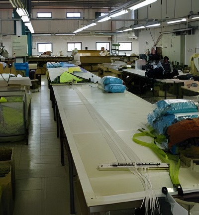

Хотя Mayday можно сложить и на полу — при условии, что он ровный и чистый, — лучше использовать
длинный стол или несколько столов, поставленных торцами друг к другу: гладкая поверхность длиной 8 м,
шириной 1 м и высотой около 80 см. На каждом конце стола нужна точка крепления, чтобы закрепить и
натянуть запаску. Хорошо подходят столярные струбцины.

#### Гребёнка

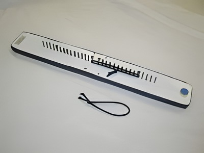

Это деревянная доска с рядом из двух групп по 11 гвоздей в каждой; она удерживает стропы разделёнными
и в правильном порядке во время складывания. Гвозди выступают над доской примерно на 20 мм.
Центральный промежуток между двумя группами гвоздей — 20 мм, обычный шаг гвоздей — 10 мм. Размеры
доски: примерно 30 см в длину, 7–10 см в ширину и около 20 мм в толщину. Доска и гвозди должны быть
гладкими, без острых углов и кромок, способных повредить купол или стропы.

#### Зажимы или грузики

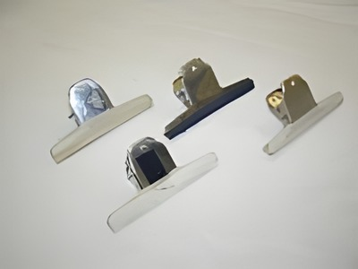

Идеально подходят шесть слабо подпружиненных зажимов — например, канцелярских. Можно использовать и
грузики: небольшие мешочки с песком, литые грузы или даже книги. Что бы вы ни выбрали, у них должны
быть гладкие края и никаких острых углов.

#### Карабины

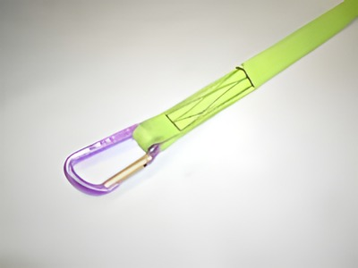

Полезно, но не обязательно иметь два карабина, чтобы цеплять вершину и стропы к точкам крепления на
столе. Подойдёт и шнур — например, отрезки стропы от крыла.

#### Стяжные ремни (2 шт.)

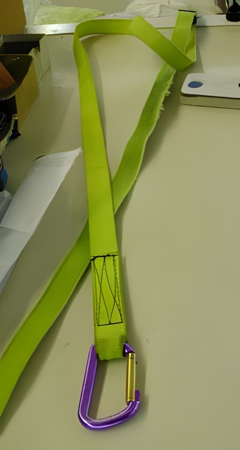

Тоже полезны, но не обязательны: ими натягивают стропы. Сгодится любая верёвка или стропа.

---

### Проветривание, раскладка и складывание

#### 1. Проветривание

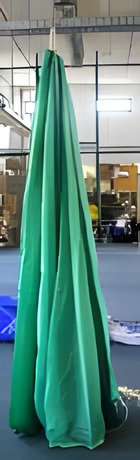

Перед началом переукладки рекомендуется «проветрить» купол в течение 24 часов. Лучше всего подвесить
его за вершину к точке на потолке. Делать это нужно в прохладном сухом месте, вне прямых солнечных
лучей.

#### 2. Раскладка

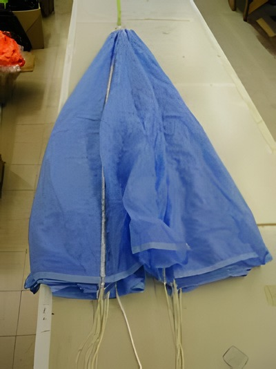

Разложите расправленный купол на столе, как показано. Проденьте карабин через **все** стропы вершины
и через петлю центральной вершинной стропы (той, что идёт к фалу). Пристегните этот карабин к точке
крепления на одном конце стола.

На одной из секций в нижнем углу, рядом с точкой крепления стропы, есть бирка Apco. Это **стропа
№ 1**. Первая и последняя стропы (№ 1 и № 16, 18 или 20) размечены так на всех парашютах. Остальные
стропы (№ 2 и далее) могут быть пронумерованы, а могут и нет — зависит от года выпуска. Если они не
пронумерованы, считайте против часовой стрелки (стоя у нижней кромки лицом к вершине, начиная
снизу).

#### 3. Крепление вершины — детально

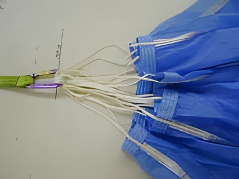

Вершину нужно пристегнуть или привязать через **все** перекрёстные стропы вершины **И** центральную
вершинную стропу (ту, что идёт внутри купола к фалу).

#### 4. Крепление строп

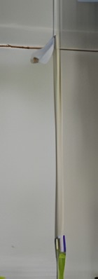

Вторым карабином охватите все стропы, кроме центральной, как показано, и с помощью двух стяжных
ремней закрепите его во второй точке крепления — на противоположном от вершины конце стола. Дайте
натяжение, чтобы все стропы выпрямились.

#### 5. Положение фала

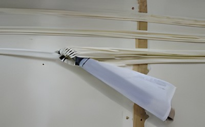

Фал теперь должен оказаться где-то между нижней кромкой купола и карабином, застёгнутым на стропах.

#### 6. Установка гребёнки

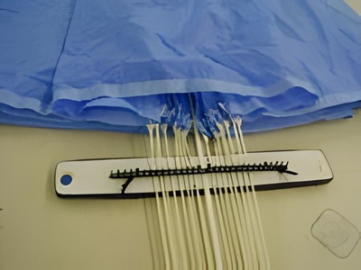

Подложите гребёнку под стропы рядом с нижней кромкой купола. Гребёнка нужна, чтобы все стропы шли
параллельно друг другу на всём пути от кромки до фала, нигде не пересекаясь, не перекручиваясь и не
путаясь.

Центральную стропу положите в широкий промежуток в середине гребёнки.

#### 7. Раскладка строп по гребёнке

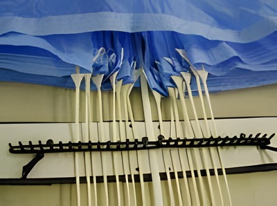

Положите стропу № 1 в первый промежуток сразу справа от центральной стропы, затем стропу № 2 — сразу
справа от № 1, и так далее, пока не разложите половину строп. Важно брать стропы строго в правильном
порядке. Проще всего для этого перекидывать секции на левую сторону. Количество строп составит
**8 у Mayday 16, 9 у Mayday 18, 10 у Mayday 20 и 9 у Mayday Bi**.

Теперь зафиксируйте эти стропы вместе с центральной прочной резинкой, накинув её на первый и
последний гвозди группы.

Перекиньте все секции на правую сторону и точно так же разложите стропы левой стороны. Последнюю
стропу (№ 16, 18 или 20) положите в промежуток сразу слева от центральной, за ней — предпоследнюю, и
так далее, пока с обеих сторон гребёнки не окажется равное количество строп. Зафиксируйте их второй
прочной резинкой (подойдёт и резинка для волос).

#### 8. Сдвиг гребёнки

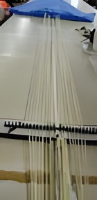

Сдвиньте гребёнку примерно на метр по стропам в сторону от кромки. Снова перекиньте левую группу
секций на правую.

#### 9. «Перелистывание» левой стороны

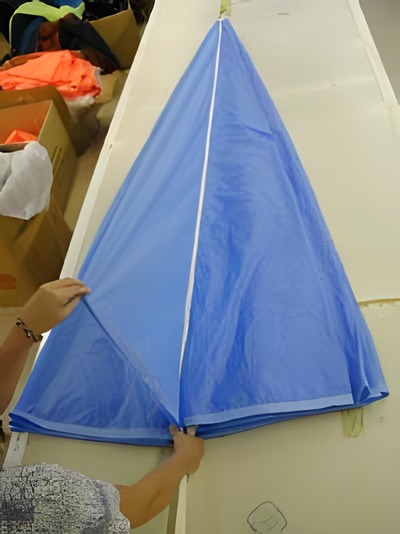

Перекиньте левую группу секций на правую. Затем возвращайте перекинутые секции обратно по одному:
поднимайте каждый одной рукой за точку посередине между двумя точками крепления строп, второй рукой
прижимая все стропы к столу. Поднимайте секцию целиком, слегка натягивая его рукой в сторону вершины.
Одновременно внимательно осматривайте каждую панель с обеих сторон на износ, повреждения, пятна,
разрушение материала, плесень и т. п.

#### 10. Укладка левой стороны стопкой

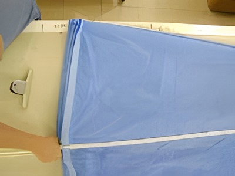

Аккуратно кладите каждую панель одну на другую, следя за тем, чтобы сгибы на середине между двумя
точками крепления выстраивались по углу, который образуют секции слева. Не поленитесь так же
аккуратно выровнять всю ленту нижней кромки — сгиб к сгибу. **Не берите больше половины секций!**
Зафиксируйте сложенные секции зажимами или грузиками.

#### 11. Угловой загиб — слева

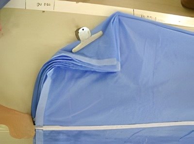

Сделайте загиб на середине левого основания под углом 45° и закрепите его зажимом.

#### 12. «Перелистывание» правой стороны

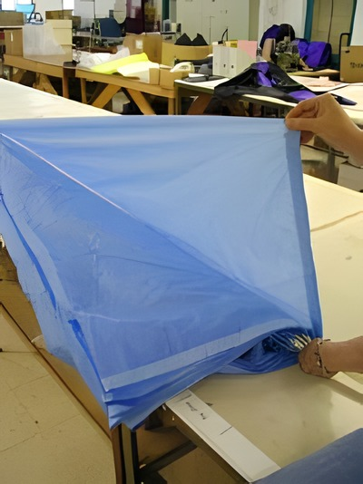

Перекиньте все правые секции на левую сторону. Теперь повторите для правой стороны все описанные выше
шаги «перелистывания». Не забывайте прижимать зажимом или рукой все стропы вместе в точках
крепления.

#### 13. Угловой загиб — справа

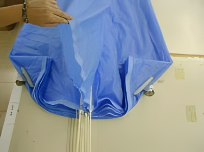

Поднимите самую верхнюю секцию правой стороны и сделайте угол в 45° так же, как слева (самую верхнюю
секцию в загиб не включайте). Зафиксируйте загиб зажимом.

#### 14. Проверка количества секций

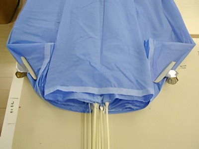

Количество секций с каждой стороны теперь должно быть таким (плюс один сверху посередине):

| Модель    | Секций слева | Секций справа |
| --------- | ------------ | ------------- |
| Mayday 16 | 8            | 7             |
| Mayday 18 | 9            | 8             |
| Mayday 20 | 10           | 9             |
| Mayday Bi | 9            | 8             |

#### 15. Зажимы

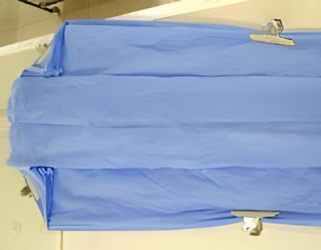

Поставьте два дополнительных зажима чуть ближе, чем на середине длины сложенного купола, убедившись,
что сгибы с обеих сторон легли ровно.

#### 16. Снятие натяжения

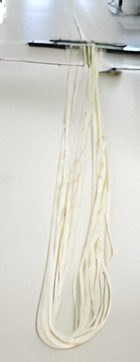

Снимите натяжение сверху и отстегните оба карабина: тот, что на стропах у фала, и тот, которым
закреплена вершина.

#### 17. Заправка вершины внутрь

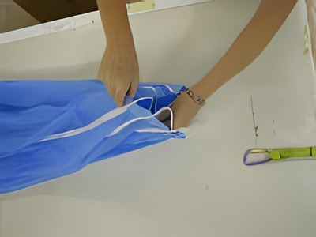
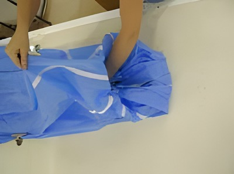
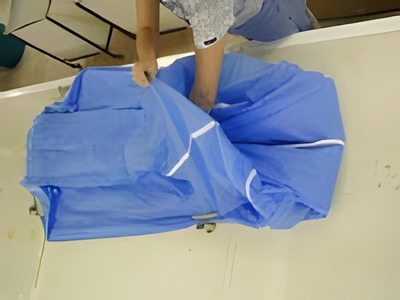

Рукой аккуратно заправьте вершину внутрь купола сверху, между секциями, настолько глубоко, насколько
достаёте.

#### 18. Втягивание вершины

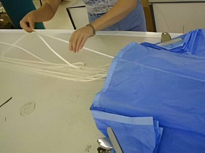

Возьмите фал и медленно тяните его от нижней кромки, натягивая все стропы. Пусть это делает помощник,
а вы следите за тем, чтобы верхний конец складывался аккуратно по мере втягивания вершины внутрь
купола. Все стропы, включая центральную (вершинную), теперь должны быть прямыми и одинаковой длины.

#### 19. Положение вершины

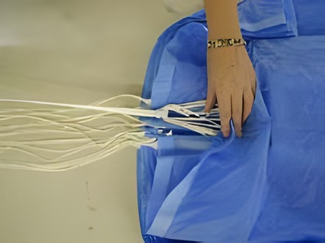

Стропы вершины не следует протягивать дальше нижней кромки. На некоторых размерах вершина вообще не
доходит до кромки. Убедитесь, что все стропы, включая вершинную, выровнены по натяжению, а фал
полностью вытянут от купола.

#### 20. Прочёсывание строп

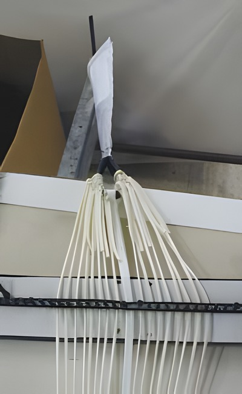

Зацепите фал за зажим на конце стола и натяните стропы (при необходимости сдвиньте купол). Проведите
гребёнку по стропам до самого фала, «прочёсывая» их вплоть до точек крепления на фале.

> **КРАЙНЕ ВАЖНО, ЧТОБЫ СТРОПЫ ШЛИ ПРЯМО И ПАРАЛЛЕЛЬНО ДРУГ ДРУГУ НА ВСЁМ ПУТИ ОТ НИЖНЕЙ КРОМКИ
> КУПОЛА ДО ФАЛА, БЕЗ ПЕРЕСЕЧЕНИЙ И ПЕРЕКРУТОВ, И ЧТОБЫ ФАЛ ЛЕЖАЛ ТАК, ЧТО СТРОПЫ ПОДХОДЯТ К НЕМУ
> БОК О БОК. НА ПОСЛЕДУЮЩИХ ЭТАПАХ СКЛАДЫВАНИЯ ФАЛ НЕЛЬЗЯ ПОВОРАЧИВАТЬ ИЛИ ПЕРЕКРУЧИВАТЬ.**

Любые перекруты и запутывания устраняются вращением фала в нужную сторону. Если это не помогает —
значит, часть панелей уложена неправильно, и придётся начать заново.

#### 21. Снятие гребёнки

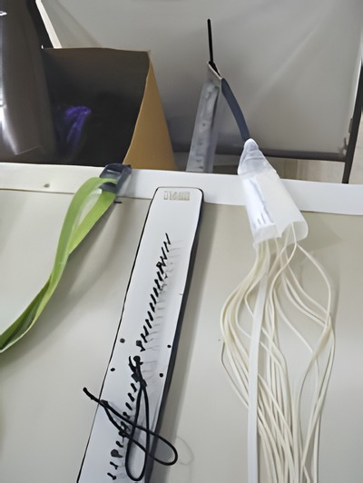

Снимите гребёнку и, внимательно осмотрев каждое место крепления, натяните на стропы закрывающую их
накладку из рипстопа. Убедитесь, что нет износа и распускающихся швов.

#### 22. Форма

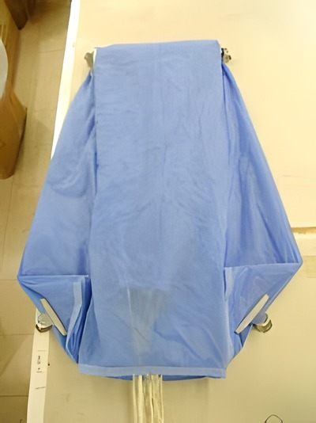

Вот так должен выглядеть частично сложенный купол на этом этапе.

#### 23. Верхний загиб

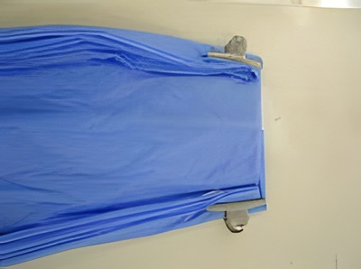

Снимите верхние зажимы и сделайте загиб на каждом углу, как показано, затем верните зажимы, чтобы
удержать загибы.

Продолжите оба загиба по всей длине купола, загибая нижние углы (углы 45°), чтобы получить
прямоугольную форму, как на следующем фото.

#### 24. Центральная секция

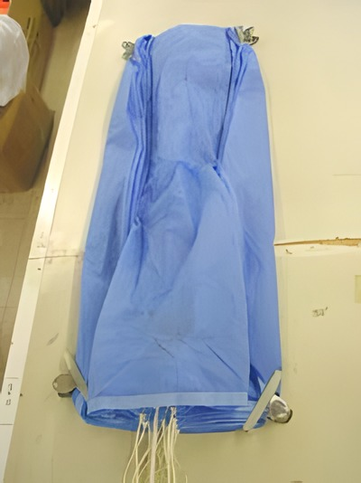

Немного вытяните центральную секцию из-под загибов и расправьте его на месте. Теперь он должен
закрывать начало загибов с обеих сторон, как показано.

#### 25. Складывание пополам

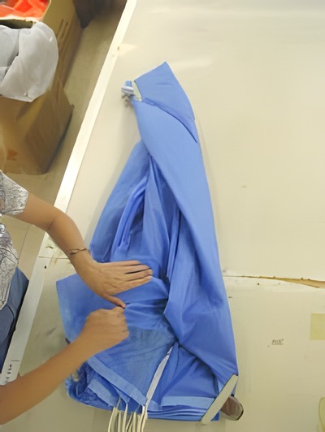

Сложите верхнюю часть запаски пополам. Снимите зажимы и поставьте один, чтобы удержать новый сгиб.

Теперь вытяните «вход» — нижнюю кромку центральной секции влево, как показано.

#### 26. Складывание

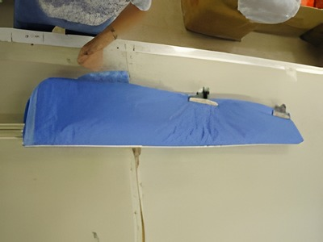

Сложите правую половину нижней части на левую. Поставьте один из свободных зажимов на середине
пакета.

#### 27. Проверка кромки

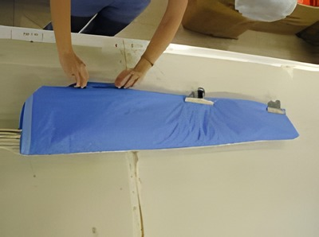
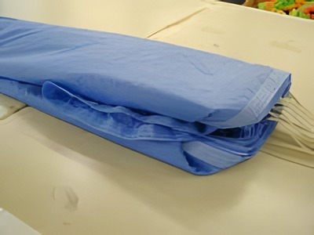

Убедитесь, что кромка центральной секции лежит аккуратно, вдоль нижнего края, и
поднимается по боку между слоями, образованными левой и правой сторонами.

---

### Укладка в контейнер

Дальше речь о внутреннем контейнере — том, в котором уложенный купол лежит
в ранце подвески и который пилот выбрасывает в воздухе.

#### 28. Подгонка по размеру контейнера

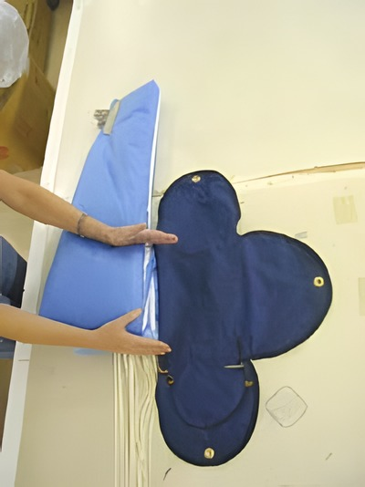

Положите рядом с запаской контейнер — тот, что в воздухе уходит из подвески вместе с куполом.
Убедитесь, что сторона с резиновым шнуром смотрит вверх и что шнур направлен в ту сторону, куда из
пакета выходят стропы, как показано.

Сложите «пакет» зигзагом так, чтобы получился квадрат, который поместится в центральную часть
контейнера.

#### 29. Складывание зигзагом

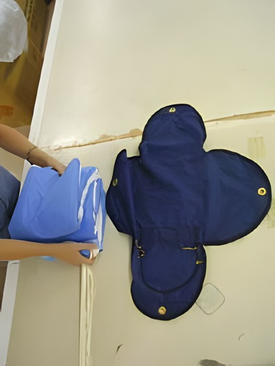
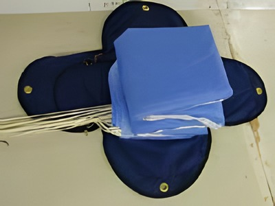
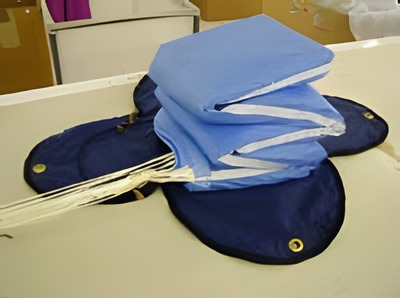

Переложите пакет на контейнер.

#### 30. Замыкание (шаг 1)

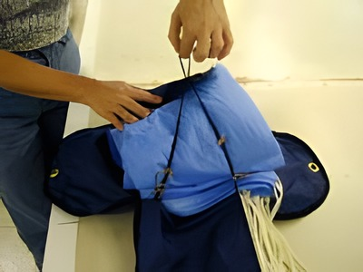

Поднимите клапан № 1 (со стороны, противоположной резиновому шнуру) и проденьте петлю из середины
шнура через люверс в клапане.

#### 31. Замыкание (шаг 2)

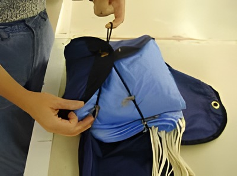

Поднимите клапан № 2 (слева) и проденьте петлю шнура через люверс в клапане.

#### 32. Замыкание (шаг 3)

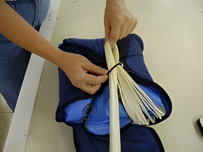

Поднимите клапан № 3 (справа) и проденьте петлю шнура через люверс в клапане. Теперь проденьте петлю
из строп через петлю шнура, чтобы запереть три клапана. Петля строп должна выступать из шнура всего
примерно на 5–6 см.

Дополнительная проверка шнура: петля строп должна начинать выходить при усилии **не более 200
граммов**.

#### 33. Укладка строп (шаг 1)

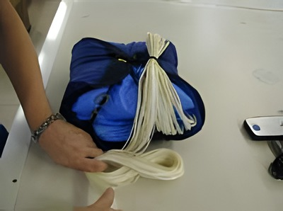

Возьмите четыре лёгкие латексные резинки и осмотрите их на трещины, износ и усталость. Лучше всего
использовать специальные парашютные резинки, которые можно купить у Apco или её дилера. Если же
приходится брать обычные канцелярские резинки, они должны быть диаметром примерно 4 см, квадратного
сечения 1–1,5 мм, свежие, качественные и одинаковой толщины по всей длине.

Закрепите по две резинки с каждой стороны резинового шнура, примерно в 3 см друг от друга и в 3 см
от конца шнура (точки его крепления к контейнеру).

Начните складывать стропы зигзагом шириной, равной ширине сложенного пакета купола. Проще всего
делать это правильно, укладывая их приплюснутыми «восьмёрками» одна на другую.

#### 34. Укладка строп (шаг 2)

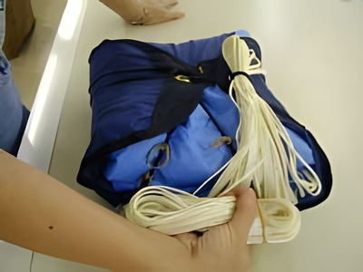

Уложив чуть меньше половины общей длины строп, остановитесь и вставьте эту «пачку» в нижнюю пару
резинок, закреплённых на шнуре.

#### 35. Укладка строп (шаг 3)

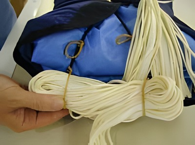

Правая резинка должна оказаться левее строп, идущих от кромки купола к первой замыкающей петле, но
правее того места, где стропы идут от первой замыкающей петли к «пачке» строп.

#### 36. Укладка строп (шаг 4)

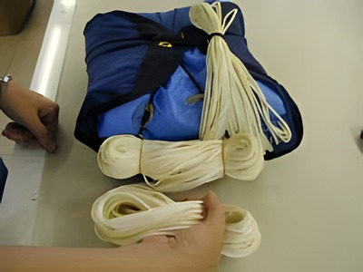

Теперь сделайте вторую «пачку» строп так же, как первую, израсходовав все стропы, кроме последних
60–70 см.

#### 37. Укладка строп (шаг 5)

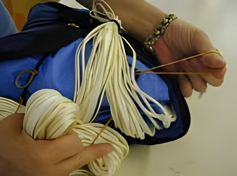

Вставьте эту «пачку» в верхнюю пару резинок. Правая резинка должна оказаться правее строп, идущих от
кромки купола к первой замыкающей петле.

#### 38. Укладка строп (шаг 6)

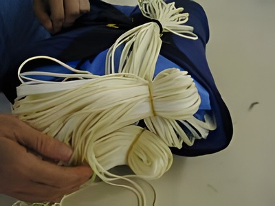

#### 39. Укладка строп (шаг 7)

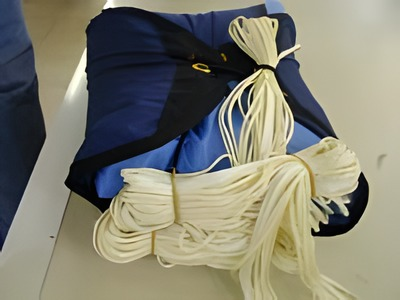

#### 40. Укладка строп (шаг 8)

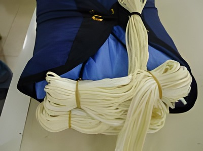

Убедитесь, что все стропы уложены аккуратно, без перекрутов, набросов строп на купол и т. п.

#### 41. Укладка строп (шаг 9)

Теперь уложите оставшийся отрезок строп поперёк «пакета».

#### 42. Вторая замыкающая петля

Сложите четвёртый клапан контейнера поверх уложенных строп. Поднимите шнур над первой замыкающей
петлёй и проденьте петлю через люверс на клапане.

Заприте последний клапан петлёй из строп — это и есть вторая замыкающая петля.

Проденьте замыкающую петлю через ленточную петлю на последнем клапане, чтобы она не мешала петле
первого замыкания.

#### 43. Уложенный парашют

#### 44. Проверка усилия

Проверьте усилие, при котором замыкающая петля выходит из шнура. Сделать это можно двумя способами.

Зацепите динамометр за петлю в оставшейся части строп и прижмите фал к контейнеру. Медленно
тяните динамометр вверх, пока стропы не начнут выходить из шнура, и снимите показание в этот момент.

Усилие при таком способе **не должно превышать 400 граммов**.

#### 45. Проверка усилия (прямой способ)

При втором (прямом) способе динамометр цепляют непосредственно за фал.

Усилие при этом способе **не должно превышать 200 граммов**.

---

## Применение

### Как пользоваться Mayday

Лучше всего, конечно, если запаска вам никогда не понадобится, но даже так полёт с ней даёт
спокойствие и чувство защищённости — а от этого летать только приятнее.

Некоторые парапланерные и дельтапланерные школы и клубы проводят курсы по применению запасок —
такой курс стоит пройти. Раскрытия выполняются над водой, пилот при этом в спасательном жилете; из
воды пилота и снаряжение достаёт катер. Такой курс даёт ценный опыт и добавляет уверенности в вашей
запаске.

### Раскрытие запасного парашюта

Первый шаг к раскрытию запаски — само решение её вводить. Если вы потеряли управление аппаратом на
большой высоте и есть шанс его восстановить, время попробовать ещё есть. Но как только запаска
введена, обратного пути нет: дальше вы летите туда, куда несёт её, и садиться придётся аварийно.

Если же нештатная ситуация возникла на малой высоте, решение нужно принимать как можно быстрее.
Принято считать, что запасной парашют нужно брать всегда, когда вы собираетесь подниматься выше 50 м
над землёй. Известны случаи спасения и с меньших высот.

Приняв решение вводить запаску, действуйте так:

1. **Найдите** ручку запаски и убедитесь, что это именно она. Сейчас не время для ошибок.
2. **Возьмитесь** за ручку крепко — большим пальцем и всеми четырьмя остальными.
3. **Рвите** сильно. Это расстёгивает липучки и вытягивает шпильки из петель. Внешний контейнер
   (отсек подвески) открывается, и у вас в руке остаётся закрытый контейнер с уложенными
   внутри куполом и стропами.
4. **Бросайте** парашют изо всех сил в направлении, которое (а) свободно от вашего параплана или
   дельтаплана и (б) желательно совпадает с направлением набегающего потока — это поможет запаске
   раскрыться быстрее.
5. **Нейтрализуйте крыло.** Если вы летели на параплане, нейтрализуйте его сразу же, как только
   раскрылась запаска, и не давайте наполниться снова: наполнившееся крыло начнёт мешать запаске.
6. **Приземляйтесь**, держа ноги вместе и слегка согнув колени, на ступни, с перекатом на бок через
   плечо — обычным парашютным кувырком при приземлении.
